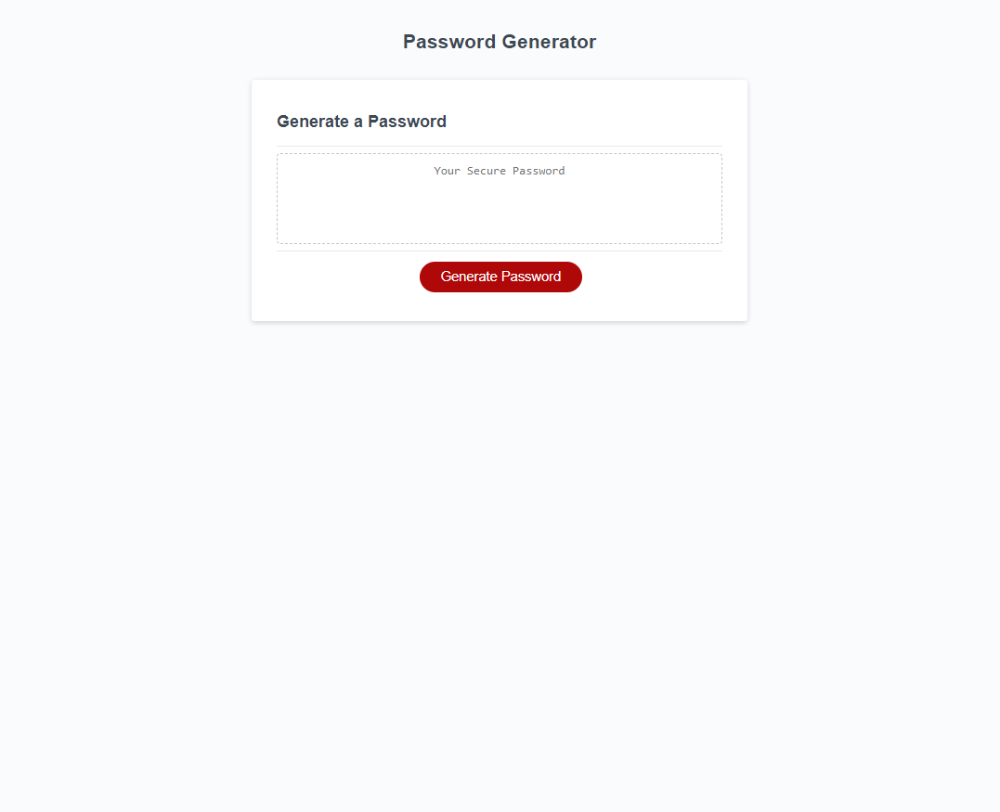

# RandomPasswordGenerator

## Description

Modified an application to where a user can select certain criteria and generate a password based on the criteria they chose. This was a project that allowed me to improve my understanding in using for loops and arrays in javascript. This application allows the user to have greater security with their password.

## Usage

http://127.0.0.1:5500/index.html link to deployed application

## Credits

Tutor session with Alexis Gonzalez  

https://developer.mozilla.org/en-US/ for reading documentation
